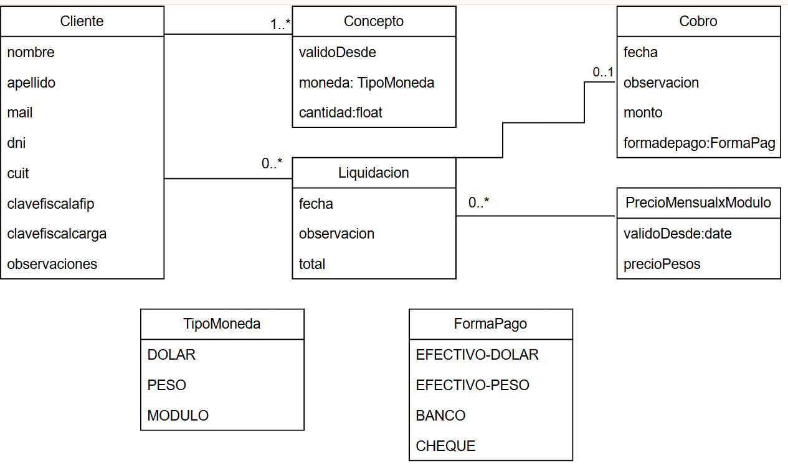
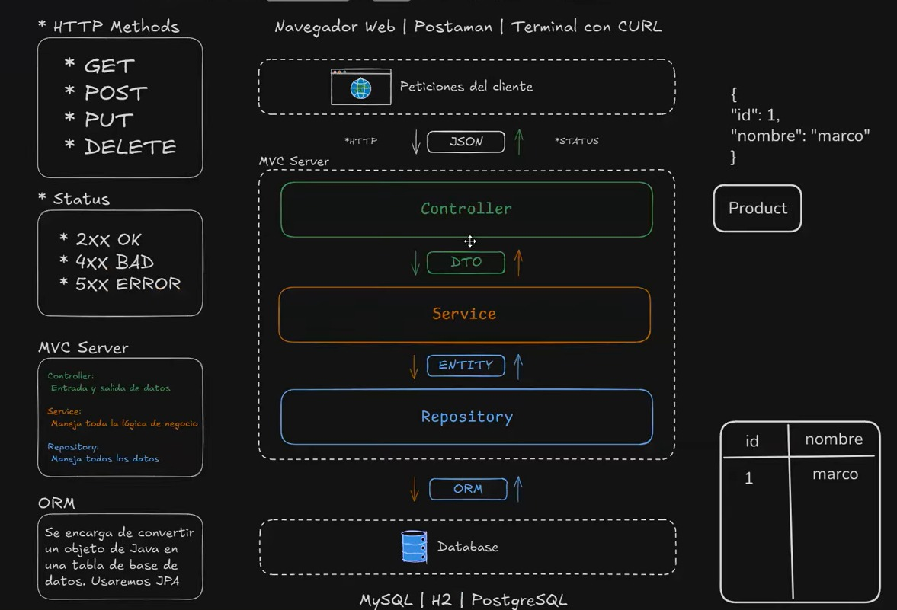

# Estudio Contable
**(Cambio de dominio)**

*El contador tiene clientes que pagan mensualmente*.
El *30 de cada mes* se crea una *liquidación* que cobra cada *concepto* asociado a cada cliente.
Cada concepto define cuánto y cómo *(en pesos, dolares o módulos)* se cobra por cliente.
Se requiere un historial de los precios de los módulos y los conceptos.
---------------------------------------
### *Acciones esperadas:*
1.	ABM clientes  (Apellido, Nombre, CUIT, forma de cobro {pesos, dolares o modulo}, mail y otros datos que se requieran
2.	Carga de valor de modulo (el modulo es un valor indicado por el CPCEBA que cmabia periódicamente, a veces lo honroarios se pactan en una cantidad de modulos y se cobran en pesos, o dólares)
3.	Envio de mail mensual, con liquidación de honorarios, que genere una deuda con el cliente
4.	Generacion por aprte del usuario de liquidación no habitual (como una certificación) que genere una deuda con el cliente
5.	Ingreso de cobros de clientes indicando forma de cobro (banco, efectivo, dólares) y fecha de ingreso
6.	Listado por parte del usuario de cuentas corrientes de clientes, resumen de saldos por clientes, resumen de ingresos por clientes
7.	Ingreso por aprte del cleinte a su cuenta corriente
8.	Cuadro de comunicación con el restudio
9.	Envio de mensajes a los clientes
### *Requisitos Funcionales:*
- Gestión de clientes (ABM): 
El sistema debe permitir alta, baja y modificación de clientes. Los campos obligatorios son apellido, nombre, CUIT, forma de cobro (pesos, dólares o módulos), email y fecha de alta/baja. Se debe validar que el CUIT sea único y el email válido.
- Configuración de módulo CPCEBA:
El sistema debe permitir la carga manual del valor del módulo, guardando histórico de valores. Los honorarios pueden pactarse en módulos, pesos o dólares.
- Liquidación de honorarios habituales:
  El sistema debe generar automáticamente, el día 28 de cada mes, un email con el concepto “Honorarios del mes {mes siguiente}”, incluyendo monto en módulos, dólares y pesos, QR de MercadoPago y datos bancarios. Esta liquidación debe registrarse como deuda del cliente. No se emitirán facturas electrónicas, solo avisos de honorarios.
- Liquidaciones no habituales:
  El sistema debe permitir la generación manual de liquidaciones especiales (ejemplo: certificaciones), registrándolas como deuda del cliente.
- Registro de pagos:
  El sistema debe permitir ingresar cobros indicando monto, fecha y forma de pago (banco, efectivo, dólares). Se podrá registrar opcionalmente un comprobante (ejemplo: número de transferencia). El tipo de cambio para pagos en dólares será cargado manualmente.
- Cuentas corrientes:
  El sistema debe mostrar listado de deudas y pagos por cliente, resumen de saldos e ingresos, y permitir exportación en PDF o Excel. El acceso del cliente será mediante CUIT y clave otorgada.
- Comunicación:
  El sistema debe incluir un cuadro de mensajes entre estudio y cliente, con envío de mensajes masivos o individuales. Se debe notificar por email cuando llega un mensaje nuevo y mantener historial de mensajes.
- Reportes:
  El sistema debe generar reportes de cuenta corriente por cliente, resumen de deudas a una fecha determinada y resumen de cobros entre fechas. Los reportes deben poder exportarse en PDF o Excel.

---------------------------------------
### *NOTAS*

---------------------------------------
### *WSDL*